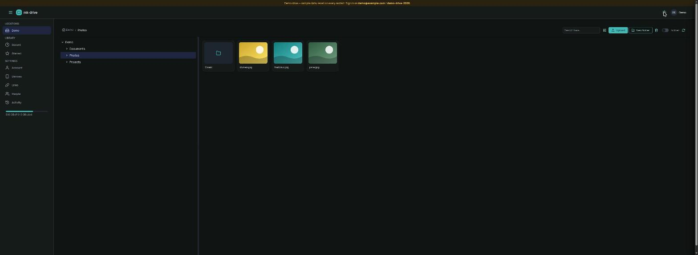
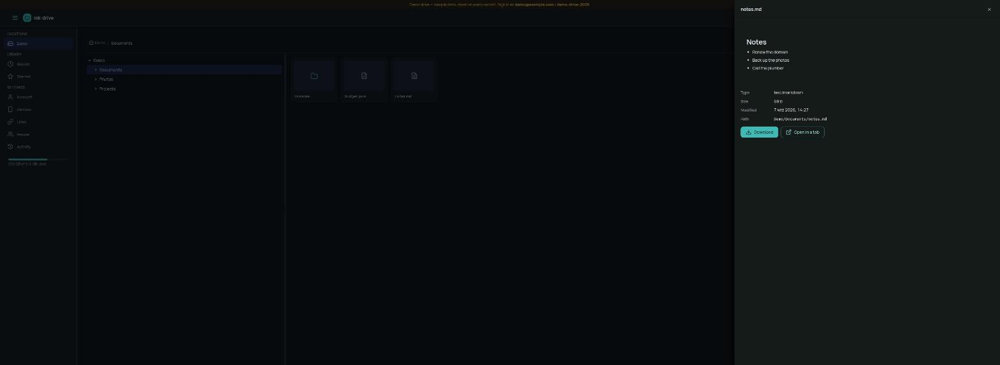
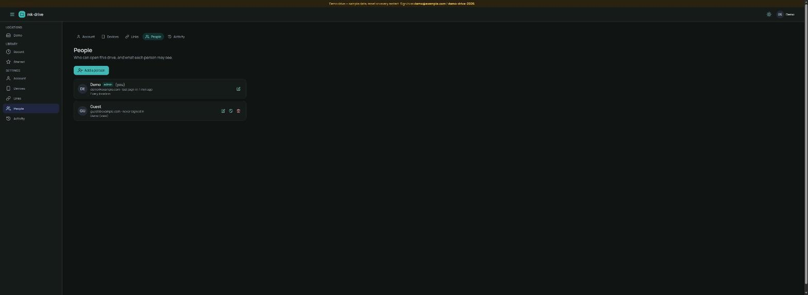

# mk-drive

A self-hosted web drive. Point it at the directories you care about — a disk,
an NFS or SMB mount from your NAS, a USB stick — and get a fast, keyboard-friendly,
installable web UI to browse, preview and download what is there. No database,
no indexing, no import: **the filesystem is the truth**, and removing the
container loses nothing.

Built with Angular 22 and [@mk-kit/ui](https://mk-kit.dev) (light & dark,
accessible), served by a Fastify API on Node 24. One container.



| Preview drawer with earlier versions | People and their access |
| --- | --- |
|  |  |

**Try it in a minute** — sample data and a demo account, reset on every start:

```bash
docker run --rm -e DRIVE_DEMO=true -p 8810:8810 ghcr.io/mkornas/mk-drive
```

Then open http://localhost:8810 and sign in as `demo@example.com` with `demo-drive-2026`.
The demo account is a member, not an admin, and it is shared, so a demo drive refuses what would
hit the next visitor: changing the account or its password, other sessions, revoking app
passwords. Files, folders, share links and signing the iOS app in all work.

**Status: usable.** Accounts with per-location access; list and grid views
with thumbnails; a lightbox for photos; previews for video, audio, PDF,
markdown, JSON and text; search by name or inside files; a home page with what arrived lately; recent and starred; downloads and zips;
chunked, resumable uploads (drop files or whole folders); new folder, rename,
move, copy; a trash with restore and undo; public share links with expiry and
optional password; earlier versions from filesystem snapshots; keyboard
shortcuts, a command palette (Ctrl/⌘ K) and drag-and-drop. See
[`PLAN.md`](PLAN.md) for what is next.

The longer story — what the pieces are, how to set it up properly, how to use
it, what to do when something is off — is in [docs/GUIDE.md](docs/GUIDE.md).

## Run it

```yaml
services:
  mk-drive:
    image: ghcr.io/mkornas/mk-drive:latest
    container_name: mk-drive
    restart: unless-stopped
    user: "1000:1000"                 # the uid that owns your files
    ports: ["8810:8810"]
    environment:
      DRIVE_ADMIN_EMAIL: you@example.com   # or leave both out and use the set-up page
      DRIVE_ADMIN_PASSWORD: change-me
    volumes:
      - /srv/files:/locations/Files
      - /mnt/nas/photos:/locations/Photos:ro
      - ./data:/data
```

Open `http://<host>:8810`. Every directory directly under `/locations`
becomes a location — read-only when the mount is. See
[`docker-compose.yml`](docker-compose.yml) for every variable.

### Locations, explicitly

Instead of discovery, describe them (names, icons, hidden top-level names):

```
DRIVE_LOCATIONS=[{"name":"Docs","path":"/locations/docs","hide":[".ssh"]},{"name":"Backups","path":"/locations/backups","mode":"ro","icon":"archive"}]
```

Dotfiles are hidden by default (a switch shows them); names in `hide` — and
`.zfs`, `.mk-drive` everywhere — are never listed nor served. The app keeps its
own things (upload parts, the trash) in `<location>/.mk-drive/`, so a move to
the trash and the final step of an upload are plain renames on the same
filesystem. Uploads travel in 8 MB pieces and resume after a dropped
connection, which also keeps them under the 100 MB request cap of Cloudflare's
tunnel.

### Who gets in

The first visit shows a set-up page that creates the admin account (or set
`DRIVE_ADMIN_EMAIL` and `DRIVE_ADMIN_PASSWORD` for a headless start). After
that the admin adds people in **Settings → People** and decides, per person and
per location, whether they may view or change it. The server enforces those
grants on every request; the UI only hides what you cannot open.

- Passwords are hashed with scrypt; sessions are server-side and revocable
  (**Settings → Devices** lists them, with "sign out everywhere else"); sign-in
  attempts are throttled per address and per account; every account change and
  sign-in lands in **Settings → Activity**.
- **Cloudflare Access** — publish the drive through a Cloudflare Tunnel with an
  Access application and set `DRIVE_ACCESS_TEAM` + `DRIVE_ACCESS_AUD`. The
  server verifies the signed `Cf-Access-Jwt-Assertion` itself, and an Access
  identity signs in as the local account with the same email. Unknown emails
  are refused, so Access never adds users on its own.
- **Forgot the admin password?** An admin can set anyone's password from
  **Settings → People** (the key icon), their own included. With nobody able
  to sign in at all, reset it from inside the container:
  `docker exec -it mk-drive node src/cli.ts password you@example.com`
  (`… users` lists the accounts). `DRIVE_ADMIN_PASSWORD` only creates the
  first account; changing it later does nothing.
- **Your look, your drive's name** — **Settings → Account → Appearance**
  picks light, dark or the device's theme and one of eight accent colours
  (kept in this browser only). An admin renames the drive from the account
  menu ("Rename this drive…"): the header shows that name to everyone, the
  app's own name and version sit at the foot of the sidebar.
- **A native iOS app** is planned: the drive inside the Files app, uploads,
  share links, and a read-only Storage tab in NAS mode. The milestones are in
  [`docs/ios-app-plan.md`](docs/ios-app-plan.md).
- **Where the password form shows** — **Settings → Sign-in** (admins) picks
  *Everywhere*, *Local network only* or *Off*, or `DRIVE_PASSWORD_LOGIN=on|local|off`
  sets it for good (the page then shows it read-only). *Local* offers the
  password only to loopback and private addresses (your LAN, `localhost`,
  Docker networks; not 100.64.0.0/10), and never to a request that came
  through Cloudflare, so the internet path shows single sign-on alone while
  the password stays the fallback at home. *Off* removes it everywhere and
  needs single sign-on first. The server refuses `/api/login` accordingly
  (403, audited); the page merely follows. App passwords work from anywhere
  in every mode, so outside the LAN the iOS app signs in with one. Locked out
  by a broken provider? `DRIVE_PASSWORD_LOGIN=on` in the environment wins
  over the page.
- **Symlinks inside a location are not followed** — they are left out of
  listings and cannot be opened, written through or deleted from the drive,
  so a link can never reach a folder someone has no grant on, a hidden name,
  or anything outside the location. Point a location at the real directory
  instead of linking into it.
- **Single sign-on** — point the drive at any OpenID Connect provider
  (Pocket ID, Authentik, Keycloak, …) on **Settings → Sign-in** (admins): a
  button name, the issuer, the client ID and secret, checked against the
  provider before they are saved, and the sign-in page gets a "Sign in with …"
  button. Nothing ships configured. A deployment that configures itself can
  set `DRIVE_OIDC_ISSUER`, `DRIVE_OIDC_CLIENT_ID`, `DRIVE_OIDC_CLIENT_SECRET`
  (and `DRIVE_OIDC_NAME`) instead; those win, and the page shows them
  read-only. The provider says who you are; the drive still
  only lets in emails that have an account here. Register
  `https://<your drive>/auth/callback` as the redirect URI at the provider,
  and `https://<your drive>/login` as the logout redirect: signing out of a
  session the provider opened ends the provider's session too. A provider
  that is not up yet when the drive starts is retried on the first login.
  Built on [`@mk-kit/auth`](https://github.com/mk-kit/mk-kit/tree/main/projects/auth).
- Cross-site requests are refused (SameSite cookies plus a JSON-only rule for
  every mutation), the app ships a strict Content-Security-Policy, and files
  that a browser would execute (HTML, SVG) are served in a sandbox.

### From a phone

Install the app from the browser menu and it appears in the phone's share
sheet: photos and files shared to it wait on a *Save to the drive* page
until you pick the folder, then upload with your session. Nothing is sent
anywhere without that step.

### Editing text

Markdown, JSON and plain-text files up to 512 KB have an **Edit** button in
the preview: a plain editor that saves the bytes exactly as typed (⌘/Ctrl+S).
The save carries the ETag the file had when it was opened; if it changed on
disk in the meantime the server refuses and asks you to reload, so two people
never overwrite each other blindly.

### Sharing

Select a file or folder and choose **Share** to create a public link: a
lifetime (a day, a week, a month, or none), an optional password, and for
folders what the link allows: browse inside, download a single zip, or **add
files only** — a file request, where visitors drop files into your folder
without seeing what is there (a taken name gets a numbered sibling). Links open
at `/s/<id>` without an account. A link stops working the moment it is removed
(**Settings → Links**), when it expires, or when its owner loses access to the
location.

A folder or a file can also be shared with another account on the drive: in the same
dialog, enter their email and choose *can view* or *can edit*. They find it
under **Shared with me** and reach only that folder or file, never the rest of the
location; you can hand out at most what you have there yourself, and the
share follows your access (it stops when yours does). Either side can end it.

### App passwords

Programs that cannot sign in with a browser (`curl`, scripts, WebDAV
clients) use an **app password**: **Settings → Devices → App passwords**
makes a long random secret, shown once, with the same access as your
account. Send it as HTTP Basic auth (`curl -u you@example.com:<secret>
…/api/ls?path=Docs`) or as `Authorization: Bearer <secret>`. Remove it
there when the program is gone. An app password cannot manage the account:
changing the password, sessions, other app passwords and the admin pages
need a real sign-in, so a leaked one cannot mint more.

### WebDAV

The same files are served over WebDAV at `https://<your drive>/dav/`, one
collection per location, with the same grants and the same trash.
**Settings → Connect** has copy-paste steps for each system, with the address
and a fresh app password filled in (GNOME Files, KDE, Finder, Explorer,
rclone for files-on-demand, phones, curl). Connect
with your email and an **app password** (not the account password): macOS
Finder (*Go → Connect to Server*), Windows Explorer (*Map network drive*,
needs HTTPS), GNOME Files, or `curl -u you:<secret> -T file
https://<drive>/dav/Docs/file`. On iPhone and iPad the Files app only speaks
SMB by itself; a WebDAV client such as Documents by Readdle, FE File Explorer
or Owlfiles connects to the same address and then shows up inside Files as a
location. Deletes land in the trash, hidden names stay
hidden, and read-only locations refuse writes. Locks are handed out but not
enforced — enough for the desktop clients, which refuse to write without them.

### Connectors

A location does not have to be a directory on the host. **Settings →
Locations** lets an admin add a **WebDAV** server (Nextcloud, another
mk-drive, anything RFC 4918) or an **S3** bucket (AWS, MinIO, Backblaze B2,
Cloudflare R2; optionally a prefix inside it) as a location, with a name, an
icon and read-only or read-write. The connection is tried before it is saved.
From then on it is a location like the others: grants, sharing, the trash,
search, thumbnails for images, WebDAV. No SDKs — WebDAV over `fetch`, S3 with
Signature V4 in a few lines — and no host mounts to manage. SMB is the one
thing that stays a host mount (`//nas/share` mounted into `/locations/…`):
Node has no maintained SMB client, and a mount is the better tool anyway.
Credentials live in the SQLite file in the data dir, like everything else the
app owns; treat `/data` accordingly.

### Versions

On a location that keeps filesystem snapshots (ZFS with a visible
`.zfs/snapshot`, as on TrueNAS), the preview of a file lists its earlier
versions with download and "restore as a copy". Nothing is configured for it;
the drive notices the snapshot directory on its own.

### Configuration

| Variable | Default | What |
| --- | --- | --- |
| `PORT` | `8810` | Listen port |
| `DRIVE_LOCATIONS` | — | JSON array of `{ name, path, mode?, icon?, hide? }`; empty = discover |
| `DRIVE_LOCATIONS_DIR` | `/locations` | Where discovery looks |
| `DRIVE_DATA_DIR` | `/data` | App state (disposable) |
| `DRIVE_ADMIN_EMAIL` / `DRIVE_ADMIN_PASSWORD` | — | Create the admin on first start instead of the set-up page |
| `DRIVE_SETUP_TOKEN` | — | A code the set-up page asks for before it creates the first admin, so a fresh drive on the network does not belong to whoever opens it first (mk-nas generates one and shows it on the box). Wrong codes are throttled. Empty = no code asked |
| `DRIVE_DB` | `<data dir>/mk-drive.db` | The SQLite file (users, sessions, grants, audit) |
| `DRIVE_SESSION_DAYS` | `30` | Session lifetime |
| `DRIVE_ACCESS_TEAM` / `DRIVE_ACCESS_AUD` | — | Cloudflare Access team and application audience |
| `DRIVE_OIDC_ISSUER` / `DRIVE_OIDC_CLIENT_ID` / `DRIVE_OIDC_CLIENT_SECRET` | — | OpenID Connect single sign-on (all three enable it, and take over from Settings → Sign-in) |
| `DRIVE_OIDC_NAME` | `Single sign-on` | What the sign-in button says |
| `DRIVE_COOKIE_SECRET` | random per start | Signs the ten-minute login cookie used during SSO; at least 16 characters (32 random bytes), a shorter one stops the start |
| `DRIVE_PASSWORD_LOGIN` | — | Where password sign-in works: `on` (everywhere), `local` (loopback and private addresses only, never through Cloudflare; `lan` is the old name), `off`. Unset or empty = chosen on Settings → Sign-in (`on` until then) |
| `DRIVE_TRUSTED_PROXIES` | `127.0.0.0/8,::1/128` | Proxies whose `X-Forwarded-For` and `CF-Connecting-IP` are believed (throttling, audit). With a Cloudflare Tunnel, include where `cloudflared` connects from — loopback on the host, or the gateway of the drive's Docker network (`docker network inspect`) when `cloudflared` reaches a published port — else every visitor through the tunnel shares one address |
| `DRIVE_HIDE` | `.zfs,.mk-drive,.trash` | Names never shown anywhere |
| `DRIVE_TRASH_DAYS` | `30` | How long deleted items stay in the trash |
| `DRIVE_DEMO` | `false` | Sample location + demo admin, recreated on every start (never for real data) |
| `DRIVE_DEMO_PASSWORD` | — | Demo mode: the demo account's password. Set one and it is never printed on the sign-in page, so only whoever you told can open the demo (an app review, a customer). Unset, every visitor is shown `demo-drive-2026`. |
| `DRIVE_DEMO_SEED` | — | Demo mode: a directory copied into the demo location on every start (real photos, videos, PDFs; timestamps kept). `tools/demo-seed/build.mjs` builds one from public-domain sources |
| `DRIVE_THUMB_DIR` / `DRIVE_THUMB_CACHE_MB` | `<data dir>/thumbs` / `512` | Thumbnail cache location and size cap |
| `DRIVE_FFMPEG` | `ffmpeg` | The ffmpeg binary for video poster frames; missing = no video thumbnails (the image ships it) |
| `DRIVE_PDFTOCAIRO` | `pdftocairo` | poppler's pdftocairo for PDF first-page thumbnails; missing = no PDF thumbnails (the image ships it) |
| `DRIVE_PDFTOTEXT` | `pdftotext` | poppler's pdftotext so "search inside files" reads PDFs too; missing = text files only (the image ships it) |
| `DRIVE_VAPID_SUBJECT` | `mailto:admin@localhost` | Web push: how a push service can reach you about this drive's requests (a `mailto:` or a URL) |
| `DRIVE_VAPID_PUBLIC` / `DRIVE_VAPID_PRIVATE` | made once | Web push signing keys. Left unset, the drive makes a pair on first use and keeps it in its database — set your own only if you want to carry subscriptions between installs; changing them makes every existing subscription useless |
| `DRIVE_NAS_SOCKET` | — | NAS mode: the [mk-nas](https://github.com/mkornas/mk-nas) agent's socket mounted in; admins get the Storage section |
| `DRIVE_NAS_MONITOR_TOKEN` | — | NAS mode: a token of 32+ characters that lets a monitor (mk-dashboard, a script) read `GET /api/nas/monitor` with `Authorization: Bearer <token>` — the pools', disks' and agent's health, nothing else; it opens no other route. Empty = no such route |
| `DRIVE_STAT_CONCURRENCY` | `32` | Parallel `stat()` calls per listing (network filesystems like this bounded) |

## Develop

Releases: `tools/release.sh X.Y.Z` tags a version; the Release workflow
publishes `ghcr.io/mkornas/mk-drive:X.Y.Z` and a GitHub Release with the
image tarball, without touching `:latest` ([`docs/releasing.md`](docs/releasing.md)).

Node ≥ 24.15. `npm install` installs both halves; `npm run dev` starts the API
on :8810 and `ng serve` on :4200 (proxied). Put some directories under
`data/locations/` to have something to browse. `npm test` runs the server
tests; `npm run build` builds the client the server serves.

Looking at the pages without a NAS: `node tools/fake-nas-agent.mjs /tmp/nas.sock`
answers every agent verb with a two-pool box's worth of data (a degraded
pool mid-rebuild, a disk with pending sectors, events, vitals, a network);
add `--empty` for a box fresh from the installer (no pool, two free disks),
which is what the set-up wizard wants. Making a pool, a dataset or a
snapshot policy changes what it answers afterwards. Run the server against
it with an admin account (Storage is admin-only, and the demo account is a
member) —
`DRIVE_ADMIN_EMAIL=admin@example.com DRIVE_ADMIN_PASSWORD=admin-password-1 DRIVE_NAS_SOCKET=/tmp/nas.sock DRIVE_LOCATIONS_DIR=/tmp/drive/locations DRIVE_DATA_DIR=/tmp/drive PORT=8830 node src/index.ts`
from `server/` after `npm run build` in `client/`, with
`FAKE_NAS_LOCATIONS=/tmp/drive/locations` on the agent so a dataset made
as a location appears in the sidebar — and
`SHOT_EMAIL=admin@example.com SHOT_PASSWORD=admin-password-1 node tools/shot.mjs http://127.0.0.1:8830 out light 1360 /storage/overview /storage/pools`
saves a PNG per path through headless Chrome (`dark` for the dark theme,
`400` for a phone).

## License

AGPL-3.0-only — see LICENSE. © 2026 Mateusz Kornaś. A commercial license (use
without the AGPL's obligations) is available: hi@mateuszkornas.com.
